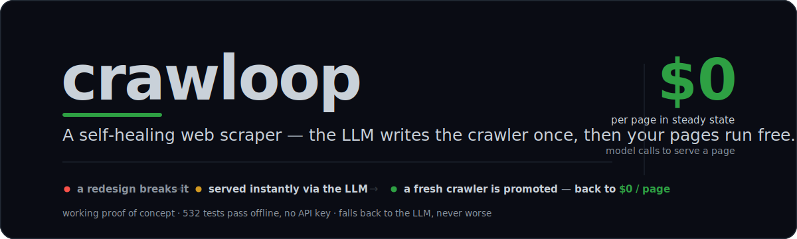
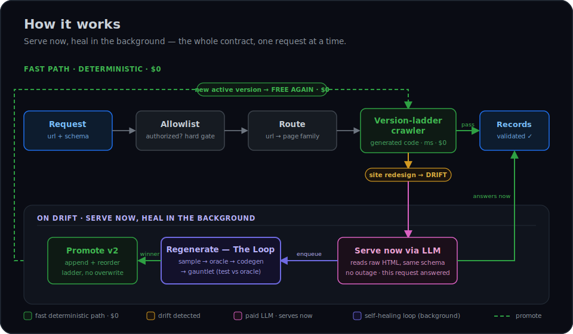
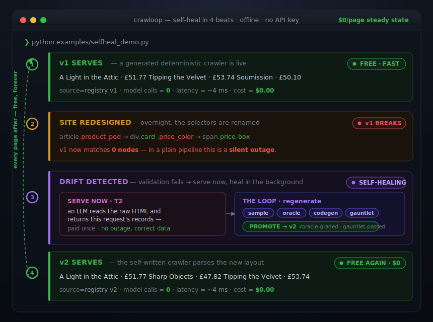

<div align="center">



[](#30-second-quickstart-no-api-key)
[](https://github.com/Jimmynycu/Crawloop/actions/workflows/ci.yml)
[](LICENSE)
[](https://www.python.org/downloads/)

</div>

**A self-healing web scraper. The LLM writes the crawler once — then your pages run free.**

Stop paying an LLM on every page, and stop scrapers that break silently when a site redesigns. crawloop compiles a cheap deterministic crawler, serves instantly via the LLM the moment one breaks, and regenerates a fresh version in the background — back to $0.

*Working proof of concept — the self-heal loop is proven end-to-end **offline** (545 tests, no key) **and live** against a real model; provider-agnostic via litellm (OpenAI / Anthropic / Gemini, auto-detected); falls back to the LLM when it can't compile a family, never worse.*

- **$0 and milliseconds per page in steady state** — the model is a compiler, not a runtime. It runs *once* to write the crawler, never to serve a request.
- **A redesign is never an outage and never silent** — drift is detected, the page is served *now* via the LLM, and a new crawler version is promoted automatically.
- **Prove it in 30 seconds, no API key, no network** — 545 tests pass offline, and one command drives the real engine through break → serve → heal → free.

```bash
python examples/selfheal_demo.py   # no API key, no network
```

[How it works →](#how-it-works) · [30-second quickstart →](#30-second-quickstart-no-api-key) · [See it heal →](#see-it-heal) · [The tradeoff →](#the-design-tradeoff)

---

## Why this exists

LLM-per-page scrapers are seductive — point a model at HTML, get JSON. But in production they have **two structural problems that never go away**:

- **You pay per page, forever.** Every page, every re-crawl, every run hits the model. At a few cents a page that's real money at scale — and unlike code, the bill never amortizes. Crawl a million pages and you pay a million times.
- **They break silently.** When a site redesigns, an LLM doesn't *know* it broke. It confidently extracts the wrong thing (or nothing) and raises no error — there is no drift signal, so you find out from downstream garbage, days later.

crawloop flips the model. **The LLM is a compiler and a teacher, not a runtime.** It writes a deterministic crawler once, acts as the oracle that grades regenerated versions, and steps in *only* during a breakage to serve data while a fresh crawler is built. Steady state runs on free, instant, byte-reproducible code.

> The contract, in five words: **serve now, heal in the background.**

---

## 30-second quickstart (no API key)

The flagship demo is the **complete self-heal cycle running entirely offline** — a scripted model and a localhost fixture server, so it needs **no `ANTHROPIC_API_KEY` and no network**. It is the proof that the whole loop works.

```bash
git clone https://github.com/Jimmynycu/Crawloop.git
cd Crawloop
python -m venv .venv && source .venv/bin/activate
pip install -e ".[dev]"

# Watch the full break → serve → regenerate → reuse → recover cycle, offline:
python examples/selfheal_demo.py
```

That narrated demo — and the matching end-to-end test ([`tests/test_selfheal_e2e.py`](tests/test_selfheal_e2e.py)) — drives the **real engine** through:

| Step | What happens | Cost |
|------|--------------|------|
| 1 · **Fast path** | a healthy generated crawler extracts records with no LLM call | **$0** |
| 2 · **Break** | the fixture site's layout is mutated (a simulated redesign) | — |
| 3 · **Serve now** | drift is detected; the page is served *immediately* via the T2 LLM fallback against the schema | paid, once |
| 4 · **Heal** | the Loop samples pages, uses the LLM as an oracle, gauntlet-scores candidates, and **promotes a v2** | paid, once |
| 5 · **Reuse** | the next request runs the healed crawler | **$0 again** |
| 6 · **Recover** | a 403 block is hit, the per-domain access ladder escalates, gets through, and **saves the winning strategy** | — |

```bash
python -m pytest   # the full suite — 545 tests, all offline, all without a key
```

> [!NOTE]
> Real runs (against your own authorized sites) need an API key for the T2 fallback and the Loop. The demo above proves the machinery first, for free.

---

## How it works

A request flows through a **version ladder of cheap deterministic crawlers** first; the LLM is only ever reached on a real breakage.

<div align="center">



</div>

**Authorize** (allowlist gate) → **route** to a registered page *family* → run that family's **version ladder** of generated crawlers (the cheap, fast path). If a version validates, items are served with **no LLM call**.

If every version fails, the failure is **classified**:

- **Drift** → served *now* by **T2** (the LLM reading the HTML against the schema) while the **regeneration Loop** rebuilds a crawler in the background.
- **Block** (429 / login wall / anti-bot) → the **access-recovery** ladder escalates and retries.
- **Transient** error → retried.
- **Gone** (404/410) → stops.

> See the full runtime architecture → **[docs/design.html#arch](docs/design.html#arch)** — tiers T0/T1/T2/Loop/Access, the two self-healing loops, and the safety model.

---

## See it heal

The offline demo, as it actually runs — a redesign breaks the crawler, the request is served anyway, a new version is written and promoted, and steady-state model calls go back to zero. The **model-calls column is the whole story**: `0` → `6` (paid once) → `0`.

<div align="center">



</div>

> Run it yourself in ~30s, no API key: **`python examples/selfheal_demo.py`** — the real engine drives the full cycle (a committed cassette stands in for the LLM). The numbers above are its actual output.

---

## The design tradeoff

The table contrasts the two **architectures** — not a benchmark, no measured numbers from any system. It is the structural argument for compiling a crawler instead of calling an LLM on every page; the axes follow directly from *"code runs vs a model runs"* and from *"the system has a drift signal vs it doesn't."*

| Dimension | crawloop | Generic LLM-per-page | Why |
|---|---|---|---|
| **Cost model** | compile **once**, then run free | a model call on **every page, forever** | the LLM bill amortizes for crawloop, never for per-page |
| **Latency** | code (parsel) — local, no round-trip | an LLM round-trip per page | deterministic code has no network step in steady state |
| **Determinism** | byte-identical output for the same page | may vary run-to-run | code is deterministic; sampling is not |
| **Drift handling** | detects validation drift → self-heals | no signal; ships wrong data blind | crawloop validates each extraction and knows when it broke |
| **Worst case** | safely falls back to the LLM = parity | — | a family it can't compile is served by the LLM, never worse |

> **Honest counterpoint:** the oracle now reads wide, deeply-nested JSON islands *in full* (proven live), and the loop escalates the model to clear the bar — but compiling a *very wide, normalized* schema to fully deterministic code is still the hard part. When crawloop can't compile a family to the bar it falls back to the LLM (= parity), spending only the one-time bootstrap.

---

## Features

- **Compile-once extraction** — LLM-generated deterministic Python crawlers; steady state runs at **$0 and milliseconds** per page.
- **Self-healing on drift** — a layout change triggers an instant LLM fallback **plus** background regeneration of a new crawler version. No outage, no silence.
- **Version ladder, not overwrite** — each family keeps an ordered `v1, v2, v3…` of immutable crawlers; healing *appends* a version and flips the active pointer (handles gradual redesigns and A/B layouts), with one-command rollback.
- **Access recovery** — a 429 / login wall / anti-bot block isn't terminal: an ordered, per-domain ladder (backoff → stealth browser → session → bypass token) escalates until one gets through, and the **winning strategy is saved** and reused.
- **Hard allowlist, enforced on every hop** — no URL outside [`authorized_domains.yaml`](authorized_domains.yaml) can ever be fetched; cross-host/SSRF redirects are refused.
- **Sandboxed generated code** — every candidate crawler is **AST-checked** (import/call allowlist, no dunder escapes) and run in a resource-capped subprocess before it can touch a real page.
- **Pluggable Pydantic schemas** — drop a `BaseModel` in [`schemas/`](schemas/); it's auto-registered as `Name@1`. Mark `VOLATILE` fields so the validator compares price/stock tolerantly.
- **Full audit trail** — every promotion and access recovery is recorded (SQLite + `audit.jsonl`): what the system did, and why, reviewable after the fact.
- **Provider-agnostic** — model calls go through [litellm](https://github.com/BerriAI/litellm); use **OpenAI, Anthropic, or Gemini**, auto-detected from whichever API key is set (or pin one with `--model` / `CRAWLOOP_MODEL`).
- **Tiered model escalation** — the loop runs a cheap model by default and escalates the *regeneration* (oracle + codegen) to a stronger model **only when no candidate clears the gauntlet**; the promoted crawler is still free deterministic code, so the one-time cost amortizes. *(See the note below.)*
- **Get the data out** — `crawloop crawl --json` returns the extracted **records** (not just a count); `from crawloop import Engine, run_loop` embeds the engine as a library.

---

## Loop engineering: tiered model escalation

A small technique that lets the **cheap default actually work**. The regeneration loop is graded by a strict gauntlet — a candidate crawler is promoted only if it agrees with the LLM oracle on **every item** (≥0.98 per-item, never a mean), the **record counts match exactly**, and it holds across **≥3 independent samples**. A cheap model is plenty for the *oracle* and the fast path, but its *codegen* may not clear that bar on a hard multi-record page.

So the loop **escalates**: it regenerates with the cheap model first, and **only if nothing clears the gauntlet** does it retry the whole regeneration (oracle + codegen) once with a stronger model ([`crawloop/llm.py`](crawloop/llm.py) `escalation_model`, wired in [`crawloop/loop/driver.py`](crawloop/loop/driver.py)). Whatever wins is still **free, deterministic code**, so the one-time stronger-model cost amortizes over every future page.

In plain terms: **spend the smart model once, only when the cheap one can't prove it's right — then run for free forever.** Proven live: starting from `gpt-4o-mini`, the loop auto-escalates to `gpt-4o` and promotes a free, multi-record crawler.

---

## Install

Requires **Python 3.12+**.

```bash
python -m venv .venv && source .venv/bin/activate
pip install -e ".[dev]"
python -m pytest  # 545 tests, no API key needed
```

The access ladder's browser rungs use a real `PlaywrightBrowserRunner` / `StealthBrowserRunner` ([`crawloop/browser.py`](crawloop/browser.py)) that **re-enforces the allowlist on every navigation and in-page redirect** (the browser bypasses the guarded HTTP client, so it gates itself). Install the browser binaries once with `playwright install`. Gated live browser tests live in [`tests/test_browser_live.py`](tests/test_browser_live.py) (`RUN_BROWSER_TESTS=1`).

**Environment variables.** No secret is ever stored in the repo or config; the config only *names* the env var to read.

- **A provider API key** — any one of `OPENAI_API_KEY`, `ANTHROPIC_API_KEY`, or `GEMINI_API_KEY` enables *real* runs (the T2 fallback and the Loop, via litellm). crawloop auto-detects which is set and picks a sane default model; override with `--model` (e.g. `--model openai/gpt-4o`) or `CRAWLOOP_MODEL`. Not needed for the test suite or for `--offline` on a healthy family.
- **Per-domain credentials / tokens** — named by the `*_env` fields in `access_strategies` (e.g. `session` → `creds_env`, `bypass_token` → `value_env`, `proxy_env`), read from the environment at fetch time.

---

## CLI usage

Installed as `crawloop` (entry point `crawloop.cli:main`). Global options (`--config`, `--db`, `--crawlers-dir`, `--fixtures-dir`) default to `authorized_domains.yaml` and a local `.crawloop/` working dir.

```bash
# Crawl one URL through the full engine (authorize → route → ladder → heal):
crawloop crawl https://books.toscrape.com/catalogue/page-1.html --schema Product@1

# Same, machine-readable:
crawloop crawl https://books.toscrape.com/catalogue/page-1.html --schema Product@1 --json

# Inspect the registry:
crawloop family list
crawloop family show books.toscrape.com/product_list

# Run the regeneration loop by hand (seeds = pages to sample):
crawloop loop run books.toscrape.com/product_list \
    https://books.toscrape.com/catalogue/page-1.html \
    https://books.toscrape.com/catalogue/page-2.html

# Inspect the per-domain access store and the audit trail:
crawloop access status
crawloop audit                                    # all events
crawloop audit books.toscrape.com/product_list    # one family

# Add --offline to forbid constructing a real model/browser (a healthy family's
# fast path needs neither; a drift/bootstrap then fails loudly, not over the network):
crawloop crawl https://books.toscrape.com/catalogue/page-1.html --offline
```

`--schema` is required only for a **new** (unrouted) URL the engine has to bootstrap from; a known family uses its stored schema.

### Adding a schema

Output schemas are plain Pydantic models contributed as `.py` files in [`schemas/`](schemas/). Drop in a `BaseModel` subclass; it's auto-discovered and registered under `f"{ClassName}@1"`. Use `extra="forbid"` so unexpected keys are caught, and declare `VOLATILE` for fields that change often so the validator compares them tolerantly:

```python
# schemas/product.py
from typing import ClassVar
from decimal import Decimal
from pydantic import BaseModel, ConfigDict, Field, HttpUrl


class Product(BaseModel):
    model_config = ConfigDict(extra="forbid")
    name: str = Field(min_length=1)
    price: Decimal = Field(gt=0, lt=1_000_000)
    currency: str = Field(pattern=r"^[A-Z]{3}$", default="GBP")
    in_stock: bool
    url: HttpUrl
    image_url: HttpUrl | None = None
    VOLATILE: ClassVar[set[str]] = {"price", "in_stock"}
```

### `authorized_domains.yaml` — the hard allowlist + crawl policy

This file is the operator's explicit, mandatory allowlist. **Every fetch must pass `AppConfig.assert_authorized`**, so a URL whose host isn't listed can never be requested. It also carries per-domain policy: rate limit, JS rendering, and the ordered **access strategies** tried when a block is hit.

```yaml
respect_robots: false          # POC default (see Authorized use). Flip to honor robots.txt.

domains:
  - domain: books.toscrape.com
    max_rps: 1.0
    render_js: false

  - domain: shop.example.com
    max_rps: 0.5
    render_js: true
    note: "owned by us; authorized 2026-06-12"
    access_strategies:         # ordered ladder; recovery walks it and persists the winner
      - backoff                #   plain GET with exponential backoff on 429/5xx
      - stealth_browser        #   patched headless browser render
      - session: { login_url: "https://shop.example.com/login", creds_env: "EXAMPLE_LOGIN" }
      - bypass_token: { header: "x-waf-bypass", value_env: "EXAMPLE_WAF_TOKEN" }
    proxy_env: "EXAMPLE_PROXY_URL"
```

---

## Authorized use

This is a tool for crawling sites **you own or are explicitly authorized to crawl**. It is deliberately *not* a general-purpose scraper for sites you have no relationship with.

- **The allowlist is mandatory.** `authorized_domains.yaml` is a hard gate on every fetch (including every redirect hop — a cross-host/SSRF redirect to an unlisted host is refused). No override.
- **`respect_robots` defaults OFF** because the intended targets are owned/authorized properties. Flip it to `true` to honor `robots.txt`; decide deliberately per deployment. *(Note: the flag is parsed but not yet enforced — see the roadmap.)*
- **The CAPTCHA rung is opt-in and authorized-domains-only.** The system never auto-defeats a captcha: `captcha_solver` raises unless an operator has explicitly set `authorized: true` for that domain *and* wired a provider (none ships here). Stealth browser and bypass tokens are likewise explicit per-domain opt-ins — courtesy headers and rate limits are the default, not evasion.

> If you would not be comfortable explaining a crawl to the site's owner, it does not belong on the allowlist.

---

## Roadmap

Stated candidly — these are the gaps between *"promising POC"* and *"drop-in replacement."*

**Recently landed** — each in plain English, with where it's proven:

- **The oracle now reads wide JSON islands in full.** A flat 8000-char prompt cap used to chop the gold record off a 100K+ `__NEXT_DATA__` island, so the loop could never promote on those pages. The hoisted JSON now gets its own budget ([`crawloop/htmlutil.py`](crawloop/htmlutil.py) `json_max_chars`, [`crawloop/fallback.py`](crawloop/fallback.py) `CRAWLER_LOOP_ORACLE_JSON_CAP`). **Proven live** (a record buried 53K deep was extracted by a real model).
- **The oracle absolutizes URLs.** It now receives the page URL and resolves relative `href`s to absolute, so listings whose `url` field was failing validation now pass. **Proven live.**
- **Tiered model escalation** (the new loop technique) — cheap model by default; escalate the regeneration to a stronger model only when the gauntlet isn't cleared. **Proven live** (`gpt-4o-mini` → `gpt-4o` → promote). See the section above.
- **Provider-agnostic** — OpenAI / Anthropic / Gemini, auto-detected; `--model` / `CRAWLOOP_MODEL` override (was hardwired to Anthropic).
- **Get the data out** — `crawloop crawl --json` returns the records; `from crawloop import Engine, run_loop` is a real library API.
- **Live-model smoke tests** — env-gated (`RUN_LIVE_LLM=1`, [`tests/test_live_llm_smoke.py`](tests/test_live_llm_smoke.py)); the loop is no longer offline-only.
- Plus: the **core-deterministic + LLM-tail hybrid** ([`crawloop/hybrid.py`](crawloop/hybrid.py)), the real **`BrowserRunner`** (Playwright + Patchright), and clean **wheel packaging**.

**Next up** — the honest deltas vs the mature tools (Firecrawl / Kadoa / Crawl4AI):

- **Prompt → schema** — describe fields in prose and have the model write the schema (today you drop a Pydantic file in [`schemas/`](schemas/)).
- **Deterministic multi-record discovery** — a free, no-LLM path for JSON-array listings (today listings promote via codegen + escalation, which works, but isn't the zero-LLM path).
- **Enforce `respect_robots`** — still parsed, not enforced (the authorized-only ethos lessens it, but it should be honored when on).
- **Managed proxies, scale, dashboards, SDKs, PyPI publish** — the operational surface the funded tools have; out of scope for a one-author POC, and called out so the comparison stays honest.

**Intentionally out of scope** for this POC (Phase 2): non-LLM fingerprint healing (T1), DOM-shingle family routing, sampled production LLM-judge, distribution monitors + scheduled canaries, a web dashboard, Postgres, and concurrency hardening.

---

## Contributing

PRs welcome — especially the open roadmap items above (**oracle reliability on huge JSON islands** and **JSON-first codegen** are the highest-impact right now).

1. Fork, branch, and `pip install -e ".[dev]"`.
2. Run `python -m pytest` (545 tests, no key needed) and `ruff check .` — both must stay green.
3. Add tests for your change; the offline fixture server (`tests/fixture_server/`) lets you exercise the full loop deterministically.
4. Open a PR describing the behavior change and how you verified it.

Found a bug or have a design question? Open an issue. See [CONTRIBUTING.md](CONTRIBUTING.md) for the full guide.

---

## License

Released under the **Apache License 2.0** — see [LICENSE](LICENSE).

<div align="center">
<br>
<sub>Built to demonstrate the self-heal + access-recovery loop on sites you own or are authorized to crawl. If it saved you from an LLM bill that never ends, a ⭐ helps others find it.</sub>
</div>
